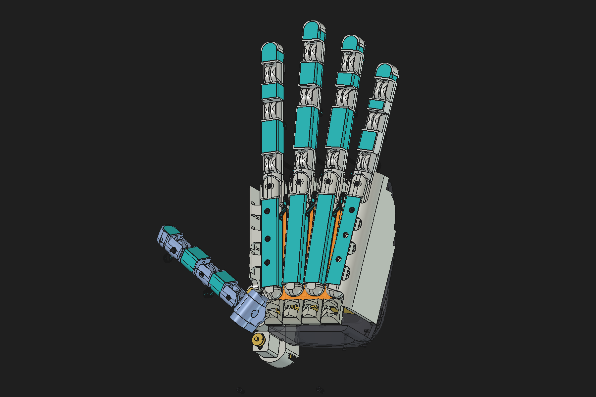
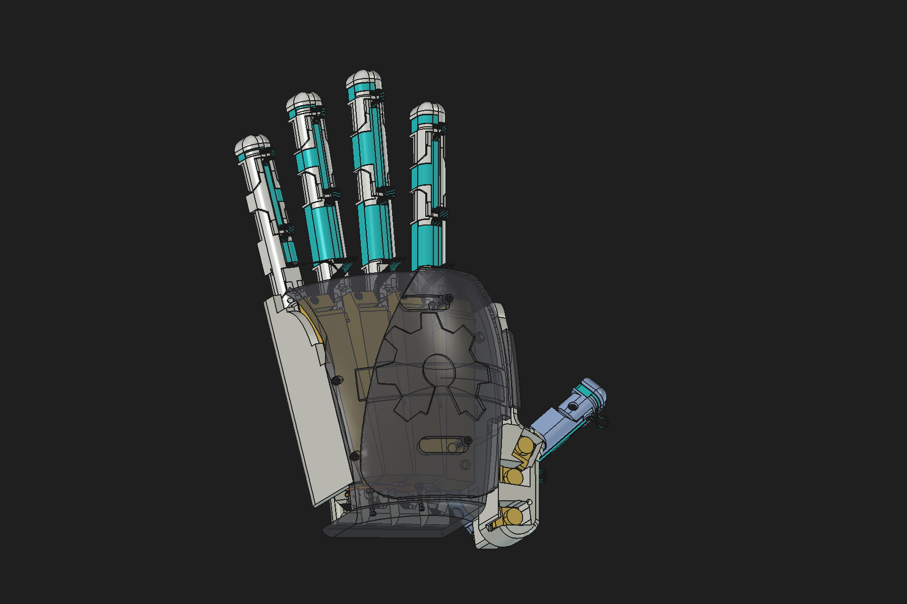
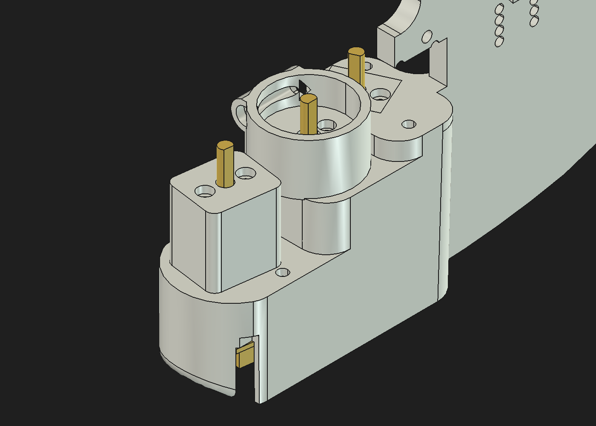
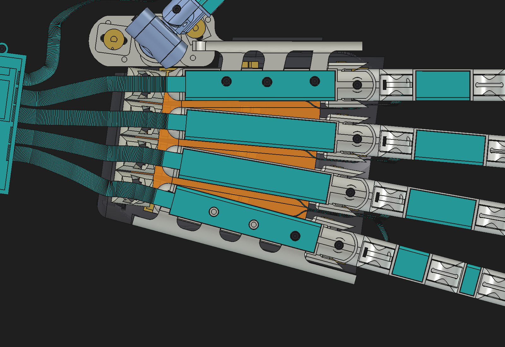

# DexiGrab V6: FreeCAD redesign (work in progress)

V6 is a full engineering pass over the V5 hand. It keeps the V5 layout and the flexible TPU palm, and fixes what broke or was missing.

The model is built by a scripted FreeCAD pipeline, so every change is reproducible:
- Each workstream (J0 joint, palm pillars, thumb, motors, shells, tactile skin, finger proportions, fasteners) is one Python module that modifies the V5 parts.
- A headless build composes the modules.
- Every result is checked for clearance and range of motion.

<p>


</p>

**Status (2026-09-26)**

- ✅ Built and verified in the model:
  - straight N20 motors
  - J0 screw joints and palm pillars
  - stronger thumb
  - palm shells
  - FlexiTac tactile skin
  - human-proportioned fingers
  - fasteners (final validation pending)
- ⏳ In progress:
  - electronics, battery pod and wiring harness
  - the 20th motor (thumb pitch)
  - V6.2 resting finger splay
  - final hardware validation and full audit

## Motors and degrees of freedom

| | Joints | Motors | Drive |
|---|---|---|---|
| **Each finger** (×4) | 4: J0 splay, J1 knuckle, J2 middle, J3 tip | 4 | A→J1, B→J2, C→J3 flexor tendons; D→J0 closed tendon loop (both ways). Every joint has its own motor. The fingers straighten on one elastic cord per joint. |
| **Thumb** | 6: R1 yaw, R2 pitch, R3 roll, R4 base flexion, R5 + R6 | 4 | T3 → yaw, direct drive. T4 → pitch, tendon loop *(being added)*. T1 → R4. T2 → R5 + R6, coupled by one tendon. Roll is passive (friction-held, −93…−23°). |
| **Hand** | **22** | **20** | **20 independently controlled DOF** |

The motors are straight (coaxial) N20 gearmotors with 6-pin Hall encoders; V5's worm GM12-N20 is no longer sold. The design assumes 1:298 gearing and 7 PPR, so measure your motors.

## What changed from V5

| V5 problem | V6 |
|---|---|
| J0: a hammered rod that cracked the part about 35 % of the time | M2×16 cap screw and M2 nyloc. The palm lug is thickened to 5 mm, with a flush counterbore, a hex nut pocket and 0.2 mm running gaps. The screw tip passes the nyloc by 3.5 threads. |
| The TPU palm insert splits each palm bone | PLA pillars through holes in the TPU. The TPU is inserted at a print pause, and every palm bone prints as one piece. |
| Weak thumb with a big gap | Real yaw bearing: Ø18 journal plus thrust ring, so the motor carries torque only. Closed gimbal, steel pin and tube at R2, M2 bolts at R4–R6. Flex stack re-clocked for opposition from Leap Motion data: pad-direction error 48.5° → 0.1°. |
| Worm motors discontinued; index and pinky motors had no room for their wires | A 2×2 N20 magazine under each palm bone. Every motor plug faces sideways into free space. |
| Thumb motors | T1 and T2 stand in their V5 seat towers, centred, turned to the seat angle and screwed to a printed floor. T3 direct-drives the yaw. |
| Palm shells | Shell2 rides on a spherical land on Shell1. Studs run through arc slots and are held by silicone O-rings: elastic retention with spherical freedom. |
| No touch sensing | [FlexiTac](https://flexitac.github.io) skin: 19 pads and 1421 taxels at 2 mm pitch. One flex circuit per finger, with slack loops at the joints. |
| Proportions | Fingers re-proportioned to the author's hand (Leap Motion bone lengths × 1.25). |
| Missing hardware | Screws, nuts, washers and heat-set inserts are modelled and placed from per-module requests, and checked by a validator. A final validation pass is pending. |
| Clearances | 0.2 mm per side wherever parts move or fit together. |

<p>


</p>

## Verification highlights

**Global clearance audit**
- Zero moving part pairs are under 0.2 mm.
- The only volume overlaps are intended ones: self-tapping screws in their pilot holes, and heat-set inserts.

**Range-of-motion sweep of all 22 joints**
- Fingers J1–J3 are clear over 0–90°.
- Coupled limits for the firmware:
  - A finger meets its neighbour at about 11° of J0 splay.
  - Thumb yaw is clear on −85…−20° at pitch 0, and on the full −85…+75° at pitch ≤ −45°. The pitch motor makes that usable.

**Thumb**
- All running clearances are ≥ 0.2 mm.
- Index and middle pinch pads meet with gaps of 0.11 mm and 0.06 mm, with no other collisions.

**Motors and tendons**
- No motor or spool overlaps; every plug keep-out is clear.
- Tendon channel walls are ≥ 1.0 mm, and bends are ≥ 3 mm radius.

**Shells**
- 48/48 checks pass.
- A 25-pose roll/tilt sweep shows no collision and no loss of retention.

**Tactile**
- Pads sit 0.2 mm proud with 0.2 mm edge clearance.
- 60 finger poses are clear, and every flex bend is ≥ 3 mm radius.

Details, numbers and open items are in [`freecad/notes/V6_REPORT.md`](freecad/notes/V6_REPORT.md), with one note per workstream in [`freecad/notes/`](freecad/notes/).

## In progress

- **Electronics**
  - 10 dual H-bridge drivers on a deck inside Shell1.
  - An I/O board on cover_back.
  - A forearm pod holding the Mini Mega2560 PRO and the two 6 V 2800 mAh NiMH packs, wired in parallel.
  - An auto-routed harness and wiring tunnels.
- **T4 thumb-pitch motor** (the 20th motor): a tendon loop from a motor fixed in the thumb-side cover to a pulley on the pitch axis. It uses the spare driver channel.
- **V6.2:** a built-in resting splay, pinky outward and index toward the thumb, fitted to Leap Motion data.
- **Final checks:** hardware validation, then the full audit and range-of-motion sweep on the complete build.

## Folder layout

```
Hardware/V6_FreeCAD/
├── freecad/DexiGrab_V6.FCStd   the current V6 model (open it in FreeCAD 1.1)
├── freecad/lib/                one module per workstream: mod_j0, mod_pillars, mod_thumb, mod_actuation,
│                               mod_shells, mod_fixes, mod_tactile, mod_proportions, mod_hardware
│                               (+ n20.py motor model, partkeys.py, v6geom.py)
├── freecad/scripts/            build_v6.py (headless build), gui_load.py / gui_colors.py (load into the GUI),
│                               audit_clearance.py, rom_sweep.py, verify_<topic>.py
├── freecad/notes/              design notes per workstream, V6_REPORT.md, V5_CAD_analysis.md
├── freecad/regions/            motor poses, fastener requests, hardware report, space claims (JSON)
├── freecad/work/shells/bake/   baked Shell2 mesh data read by mod_shells
├── data/                       assembly transforms, joint definitions, V5 CAD analysis tables
├── v5_step/                    V5 part STEP export (pipeline input)
└── images/
```

## Open and rebuild

To just look at the model, open `freecad/DexiGrab_V6.FCStd` in FreeCAD 1.1.

To rebuild it:

1. **Point the scripts at your checkout.** They use absolute paths, which ship as a placeholder:

   ```bash
   cd Hardware/V6_FreeCAD
   python3 - <<'EOF'
   import pathlib
   root = pathlib.Path('.').resolve()
   PH = '/path/to/DexiGrab-Robot-Hand/Hardware/V6_FreeCAD'
   for p in root.rglob('*'):
       if p.is_file() and p.suffix in ('.py', '.sh', '.json', '.md'):
           s = p.read_text()
           if PH in s:
               p.write_text(s.replace(PH, str(root)))
   EOF
   ```

2. **Build every part headless**, which takes about 5 minutes. `freecadcmd` ships with FreeCAD; on macOS it is `/Applications/FreeCAD.app/Contents/Resources/bin/freecadcmd`.

   ```bash
   V6_RUN=1 V6_OUT=$PWD/freecad/work/built.FCStd V6_BREP=$PWD/freecad/build \
       freecadcmd freecad/scripts/build_v6.py
   ```

   `V6_MODULES=j0,pillars,...` selects and orders the modules; the default is all of them.

3. **Load the build into the GUI.** Open `freecad/DexiGrab_V6.FCStd`, then run `freecad/scripts/gui_load.py` and `freecad/scripts/gui_colors.py` from the Python console.

4. **Check it.** Each script takes the built file as `V6_IN=freecad/work/built.FCStd`:
   - `freecad/scripts/audit_clearance.py`
   - `freecad/scripts/rom_sweep.py`
   - `freecad/scripts/verify_<topic>.py`

The source parts are the V5 "simulacra" assembly, exported from Onshape with its exact occurrence transforms (`data/top_assembly_definition.json`).

## Licences

- The V6 files follow this repository's licences: CERN-OHL-W v2 for hardware and GPL-3.0 for software.
- The tactile skin reuses [FlexiTac](https://flexitac.github.io)'s readout board and firmware unchanged. FlexiTac is CC BY-NC 4.0 (non-commercial, attribution required), and that applies to any FlexiTac-derived parts you build.
